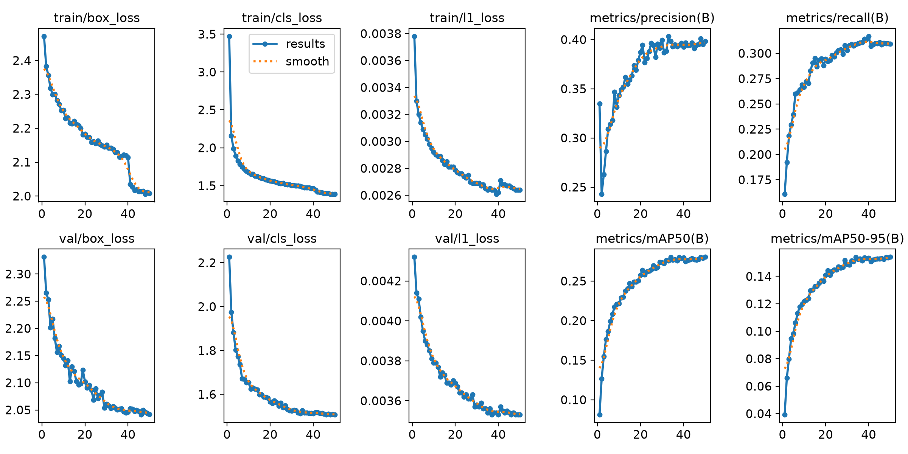
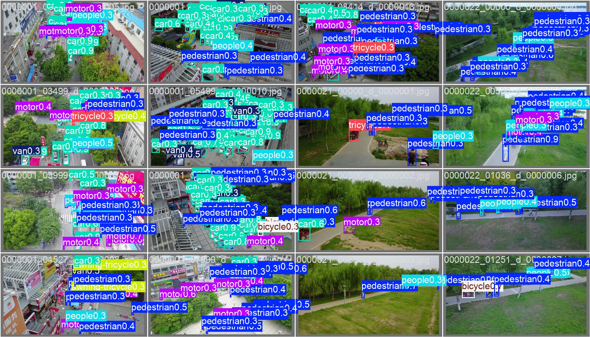
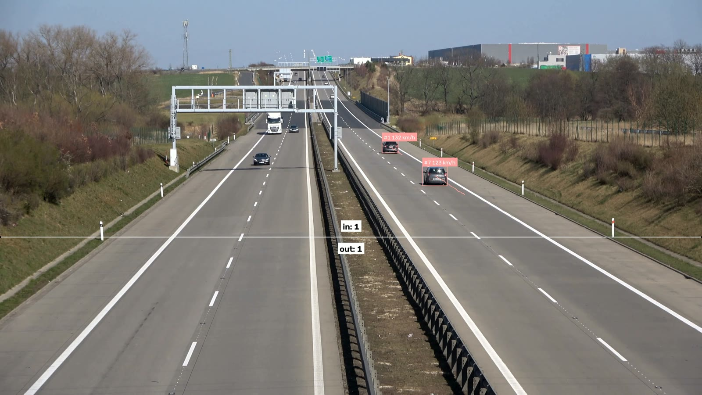
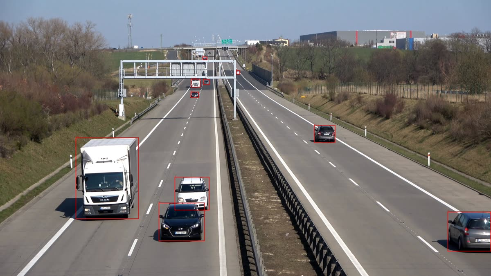

# Project 2 — Traffic Lens 🚗

Vehicle detection → tracking → line-crossing counts → calibrated speed estimates, plus a
foundation-model auto-labeling workflow and a YOLO26 fine-tune on VisDrone.

**📊 [Read the full write-up online](https://akshay131996.github.io/traffic-lens/)** — results,
figures and the five silent bugs, rendered as a page.


*YOLO26n + ByteTrack on 4K motorway footage: per-vehicle IDs, motion traces, a
line-crossing counter, and homography-derived speed labels.*

> 📓 **[LEARNINGS.md](LEARNINGS.md) — five silent bugs in run 1, and how each was caught.**
> The first pass of this project ran end-to-end without a single error and still produced
> wrong results: a baseline that measured label-space mismatch instead of model quality,
> speeds off by ~8×, and a tracking metric that couldn't answer its own question. None of
> them threw an exception. That write-up is the most useful thing in this repo.

## Lessons

1. **What changed in YOLO since v5** (interview staple): anchor boxes died (v8 went anchor-free), then NMS died (v10/YOLO26 are trained end-to-end with one-to-one label assignment, so no duplicate-box cleanup step). Result: simpler pipelines, faster CPU/edge inference. The API you remember (`model(image)`) survived.
2. **YOLO vs DETR-family:** transformer detectors (RT-DETR, RF-DETR) win on accuracy at similar model sizes; YOLO wins on edge speed and tooling maturity. "It depends, here's my benchmark" is the senior-engineer answer — run `benchmark.py --include-rtdetr` and have your own numbers.
3. **Tracking = detection + data association.** ByteTrack is dumb-simple (IoU matching + Kalman prediction, and it *keeps low-confidence boxes* — that's the paper's whole trick) and still near-SOTA. Know why ID switches happen: occlusion, missed detections, crossing paths.
4. **Auto-labeling changed data economics.** Grounding DINO/SAM 3 propose labels from text prompts; humans correct instead of draw. `autolabel.py` is that workflow. The catch — and your blog angle — is *silent bias*: the foundation model misses exactly the hard cases you most need labeled.
5. **Speed needs geometry, not ML.** Pixel distances are distorted by perspective; a homography maps the road plane to meters (see `ViewTransformer`). Calibration: pick 4 points on the road forming a rectangle you can measure in the real world (lane width ≈ 3.5 m, dashed-line period ≈ 12 m in many countries) — that's your `calib.json`.

## Run everything on Colab (this is how the results below were generated)

This laptop has no GPU, so all real execution — the calibrated pipeline run, the
ByteTrack parameter sweep, the auto-labeling demo, the VisDrone fine-tune, and a
functional test of the app below — happens in one notebook:
**[`run_all_colab.ipynb`](run_all_colab.ipynb)**. Open it in Colab, set
**Runtime > Change runtime type > T4 GPU**, Run all, and it downloads every artifact
(annotated video, sweep results, auto-label preview bundle, fine-tuned weights, mAP
comparison) at the end.

The VisDrone fine-tune section is the long one (dataset download + ~20 epochs on a T4 is
roughly 30-60+ minutes) — see the notebook's note about switching to a remote VM if a
Colab session limit gets hit before it finishes.

## Run it locally

The scripts still work standalone if you have your own GPU (or just want a quick CPU
check on a short clip) — this is what `run_all_colab.ipynb` calls under the hood:

```powershell
# demo: bundled highway video, pretrained model, 100 frames
python track_count_speed.py --max-frames 100
# -> outputs/annotated.mp4  (open it! traces, IDs, line counts)

# benchmark on your machine
python benchmark.py

# auto-label your own frames (model downloads ~700MB once)
python autolabel.py --source my_frames/ --classes "car,truck,bus"

# upload-a-video app (Gradio) -- same pipeline, browser UI
python app.py
```

Extract frames from any video for labeling:
`ffmpeg -i dashcam.mp4 -vf fps=2 my_frames/f_%04d.jpg` (or use the notebook's cv2 cell).

## Getting real data (the part that makes it portfolio-worthy)

- **Best:** your own phone/dashcam footage of a busy road (tripod, 10 min, 1080p). Custom data = the story interviewers ask about. Point `run_all_colab.ipynb` or `track_count_speed.py --source` at it once you have it.
- **What this repo actually fine-tunes on today:** Ultralytics' built-in `VisDrone.yaml` (drone traffic, properly labeled, auto-downloads) — chosen specifically so the fine-tune/mAP comparison doesn't block on manual label correction.
- **The auto-labeling workflow** (`autolabel.py` / the notebook's section 6) is demonstrated separately on frames from the bundled demo video, producing YOLO-format labels ready for CVAT import. Correcting those by hand and timing it against labeling from scratch is a real exercise worth doing on your own footage — that's inherently manual, not something to script away.

## What's here

| File | Purpose |
|---|---|
| `run_all_colab.ipynb` | **Run this first.** Does everything below on a Colab GPU, downloads every artifact. |
| `track_count_speed.py` | Detect+track+count(+speed) pipeline — `process_video()` is the shared core logic |
| `app.py` | Gradio app: upload a video, get an annotated one back, built on `process_video()` |
| `autolabel.py` | Grounding-DINO auto-labeling — text prompt in, YOLO-format labels out |
| `benchmark.py` | YOLO26 vs YOLO11 (vs RT-DETR) latency benchmark |
| `outputs/calib.json` | The measured speed-calibration quad for this clip — 25 m × 250 m (see Results) |

## 🔨 Your turn

1. Point the pipeline at your own footage (phone/dashcam) instead of the bundled demo video — everything else stays the same.
2. Time yourself: label 20 frames from scratch in CVAT vs correcting the notebook's auto-labeled output. That ratio is blog post #2's headline number.
3. Fine-tune on your own corrected dataset instead of VisDrone, once you have one, and compare against both the VisDrone-fine-tuned and pretrained-COCO checkpoints.
4. Verify the calibrated speed estimates against a real, known reference (a speed-limit sign, a GPS speedometer) rather than trusting the estimate as-is.
5. Deploy `app.py` to a Hugging Face Space for a live demo link.

## Results

From one end-to-end run of [`run_all_colab.ipynb`](run_all_colab.ipynb) on an **NVIDIA
RTX 4000 Ada (20 GB)**, Ultralytics 8.4.104 / torch 2.4.1+cu124. Raw numbers:
[`outputs/run2_results.json`](outputs/run2_results.json).

> This is **run 2**. Run 1 finished without a single error and was wrong in five places —
> a baseline that measured label-space mismatch, speeds off by ~8×, a metric that couldn't
> answer its own question. [**LEARNINGS.md**](LEARNINGS.md) documents each one and how it
> was caught. The corrections below are the point of this project.

### VisDrone fine-tune

YOLO26n fine-tuned on [VisDrone2019-DET](https://github.com/VisDrone/VisDrone-Dataset)
(6,471 train / 548 val, 10 classes), 50 epochs, imgsz 640, batch 16, ~60 min:

| metric | 20 epochs (run 1) | **50 epochs (run 2)** |
|---|---|---|
| mAP50 | 0.246 | **0.280** |
| mAP50-95 | 0.134 | **0.154** |
| precision | 0.364 | **0.402** |
| recall | 0.292 | **0.308** |



**This one actually converged.** mAP50 over the last three epochs: 0.2801 → 0.2790 →
0.2804 — flat. Run 1 stopped at 20 epochs with the curve still climbing, purely because
its cosine schedule had decayed the LR to zero; that was a budget artifact being reported
as a result. The extra 30 epochs bought +3.4 pp mAP50, and the curve says there's little
left on the table without a bigger model or higher resolution.

Weights: [`yolo26n_visdrone_finetuned.pt`](yolo26n_visdrone_finetuned.pt) (5.4 MB) ·
per-epoch metrics: [`outputs/visdrone/results.csv`](outputs/visdrone/results.csv)



### Was fine-tuning worth it? (a baseline that's actually valid)

Run 1 answered this with `YOLO("yolo26n.pt").val(data="VisDrone.yaml")` and got 0.0174
mAP50 — a number that measured nothing, because `val()` matches predictions to ground
truth **by class index**, and the COCO-pretrained model's index 4 (`airplane`) was being
graded against VisDrone's index 4 (`van`).

Run 2 remaps VisDrone ground truth into COCO's label space (`pedestrian`+`people`→person,
`car`+`van`→car, `motor`→motorcycle, `bus`→bus, `truck`→truck, `bicycle`→bicycle), drops
`tricycle`/`awning-tricycle` which have no COCO equivalent, and evaluates both models on
the categories they genuinely share:

| model | mAP50 | mAP50-95 |
|---|---|---|
| COCO-pretrained (remapped GT, shared classes) | 0.028 | 0.013 |
| **Fine-tuned (shared classes)** | **0.320** | **0.176** |

**≈11× improvement — and this comparison holds up.**

The interesting part: fixing the label mapping moved the baseline from 0.0174 to only
0.0276. The pretrained model really is near-useless on this data, so run 1's *conclusion*
("fine-tuning helps enormously") was directionally right while its *measurement* was
meaningless. Both facts are worth stating — a right answer from a broken method is still
a broken method, and it only looked fine here by luck.

Why the domain gap is that severe: VisDrone is shot from drone altitude, so objects are a
handful of pixels — far smaller than anything in COCO's distribution. Scale, not just
category vocabulary, is what breaks the pretrained model.

*One asymmetry to note honestly:* the fine-tuned model must split `pedestrian` vs `people`
and `car` vs `van`, while the baseline gets to lump each pair into one COCO class. The
fine-tuned task is therefore *harder*, so if anything the 11× understates the gap.

### Inference resolution: 640 vs 1280 px

Same clip, same model, same tracker — only the inference size changed:

| | 640 px | **1280 px** |
|---|---|---|
| detections / frame | 3.10 | **4.88** (+57%) |
| mean track length | 47.8 frames | **81.3 frames** (+70%) |
| unique IDs | 13 | 12 |
| median speed | 124.1 km/h | 122.9 km/h |

Read those together: **more detections per frame, yet *fewer* unique IDs and much longer
tracks.** Higher resolution didn't just find extra vehicles — it stopped the tracker
losing and re-issuing the ones it already had. On 4K footage the 640 px default shrinks a
distant car to a few pixels, so it flickers in and out of detection and fragments into
several short tracks.

Visible in the output — 640 px on the left finds two vehicles, 1280 px finds five,
including the truck under the gantry:

| 640 px | 1280 px |
|---|---|
|  |  |

### ByteTrack parameter sweep

Same 200-frame clip at 1280 px ([`outputs/bytetrack_sweep.json`](outputs/bytetrack_sweep.json)):

| `track_activation_threshold` | `lost_track_buffer` | unique IDs | detections/frame | mean track length |
|---|---|---|---|---|
| 0.50 | 10 | 8 | 4.28 | **106.9** |
| 0.25 | 30 | 12 | 4.88 | 81.3 |
| 0.10 | 60 | 12 | 4.92 | 82.0 |

Run 1 logged only the unique-ID column, which can't distinguish "the tracker fragmented
one car into three" from "a lower threshold legitimately found three more cars". Logging
detections/frame and track length alongside makes the two hypotheses predict different
things, and the answer here is legible:

- **0.50 → 0.25** raises detections/frame (4.28 → 4.88) *and* IDs (8 → 12) while mean
  track length falls (106.9 → 81.3). So it's genuinely finding more vehicles, but the
  extra ones are marginal detections forming shorter, flakier tracks — both effects at once.
- **0.25 → 0.10** changes essentially nothing (+0.04 detections/frame, identical IDs).
  The threshold has saturated; there's nothing left to admit.

Practical read: `0.50 / 10` gives the most stable tracks and would be right if you only
care about confidently-tracked vehicles; `0.25 / 30` trades some stability for ~14% more
coverage. Going below 0.25 buys nothing. Crossing counts stayed at 2 in / 1 out across all
three — the vehicles that actually cross the line are large and confidently detected, so
the counter is insensitive to these knobs.

*Still a proxy:* a real ID-switch count needs ground-truth tracks and MOTA/IDF1, which
this clip doesn't have.

### Speed estimation

Median **122.9 km/h** across tracked vehicles — plausible for free-flowing motorway, and
the first thing to check before trusting any of it.

Run 1 reported 53–64 km/h because its calibration quad was placed by eye and assumed 7 m ×
30 m of road. The measured region for this clip is **25 m × 250 m**
([`outputs/calib.json`](outputs/calib.json), from
[supervision's speed-estimation example](https://github.com/roboflow/supervision/tree/develop/examples/speed_estimation)).
Distance error propagates linearly into speed, so under-measuring the road by ~8× under-
reported every speed by ~8×.

The pipeline also now discards points that fall outside the calibrated quad — a homography
extrapolates confident nonsense beyond the region it was fitted on.

**This calibration is valid for this camera only.** Any other footage needs its own
measured road quad, or the speeds will be wrong in exactly the same way.

### Auto-labeling with Grounding DINO

37 zero-shot boxes across 6 frames from the text prompt `"car. truck. bus. motorcycle."` —
no training, no manual annotation:



Output is YOLO-format, ready for CVAT import. The human correction pass — and the "how
much faster is correcting than drawing from scratch?" timing — is genuinely manual and
hasn't been done yet.

## Definition of done

- [x] Pipeline code + Gradio app + auto-labeling + fine-tune notebook written and pushed
- [x] `run_all_colab.ipynb` executed end-to-end on GPU, artifacts committed
- [x] VisDrone fine-tune trained to convergence (50 epochs) + weights published
- [x] **Valid** pretrained baseline via label-space remapping — ~11× gain, defensible
- [x] Speed calibration against a measured road region (122.9 km/h median, plausible)
- [x] Resolution ablation showing 1280 px cuts track fragmentation, not just adds detections
- [x] Tracker sweep with metrics that can actually distinguish the competing explanations
- [x] Every run-1 error documented in [LEARNINGS.md](LEARNINGS.md)
- [ ] Gradio app verified live + deployed to a Hugging Face Space
- [ ] Benchmark table (YOLO26 vs YOLO11 vs RT-DETR) in this README
- [ ] Own footage (not just the bundled demo video) run through the pipeline
- [ ] CVAT correction pass + auto-label-vs-scratch timing
- [ ] Blog post: the label-space bug and the auto-labeling workflow
